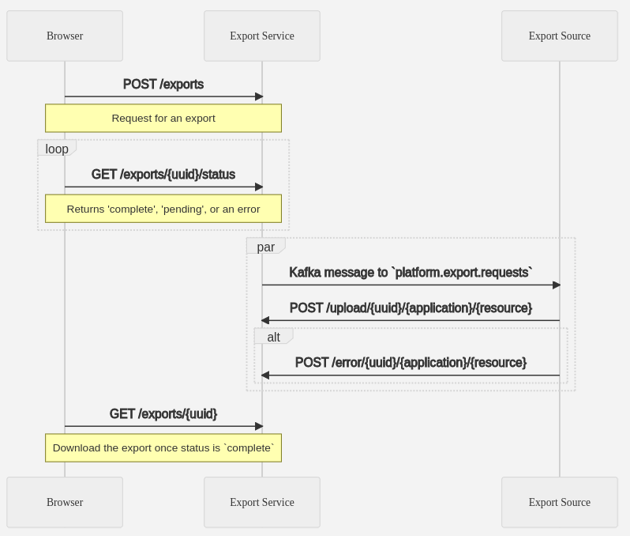

# Integrating with the export service
The basic process of using the export service is as follows:

## For data sources

In order for your service act as an **source application** for the **export service** as shown above, your service must consume events from the `platform.export.requests` topic. The **export service** will send a message to this topic when a new export request is created. This message will contain the following information:

- `uuid`: identifier for the export request
- `application`: identifier for the application a request is being made for
- `resource`: identifier for the resource a request is being made for
- `format`: the format the export should be in. `json` or `csv` (`pdf` is not supported yet)
- `x-rh-identity`: the auth header of the user that requested the export. Can be used for logging, or for custom authorization/filtering by the app.
- `filters`: application-specific, schemaless `json` object used for filtering the data to be exported. This is not required. (not supported yet)

The **source application** must POST the export data to the `platform.export.results` topic in the requested format. The **source application** is responsible for the consumption from the kafka topic, interaction with the application datastores, formatting the data, and posting the data to the export service API. (auth via pre-shared key)

## For the browser front-end

For allowing users to request and download these exports, the following steps are required in the **browser**:

- The user must be logged in, so that the appropriate `x-rh-identity` header is present in their request.
- The user-interface should allow the users to create new export requests, poll to see if the export is ready, and finally download the export when it is ready. The user-interface should also allow the user to delete completed exports via the `DELETE /exports/{uuid}` endpoint.

